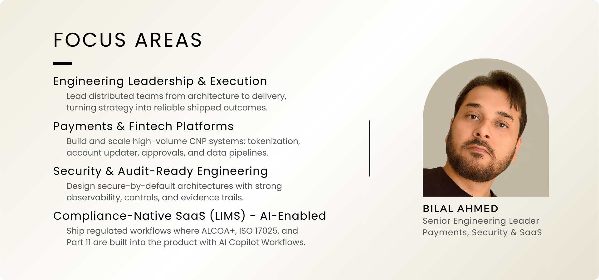

  

## :material-briefcase: Start with Work

### :material-briefcase: Quick Start for Hiring Teams
If you’re evaluating me for a **Senior Engineering Manager / Director** role, start here. These are decision-dense case studies with the parts that matter:
**context → constraints → tradeoffs → execution → outcomes**.
  
**You’ll see how I run delivery:** Scrum/Jira cadence, quality gates, CI/CD, on-call health, and cross-functional alignment.
  
[:material-arrow-right: Open Work Overview](work/){ .md-button .md-button--primary }

### :material-flask-outline: Research & Notes
Short posts, experiments, and deeper write-ups on building modern systems—especially **AI/agents** and **regulated/audit-ready platforms (LIMS)**.
  
**Expect:** practical patterns, diagrams, references, and reusable frameworks—not hype.
  
[:material-arrow-right: Browse Research](research/){ .md-button }

